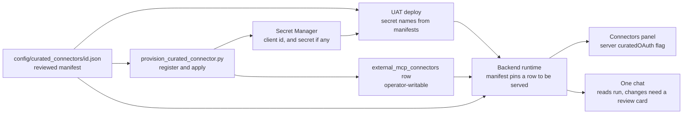

# Curated MCP Connectors

A curated connector is an operator-registered OAuth MCP provider (HubSpot and
Notion today) that an owner connects from Connectors and then uses in One chat.
Everything the application must not take from the operator-writable registry is
kept in one reviewed, checked-in file per provider. Attio's cross-origin public
client shape is supported by the provisioning contract, but it intentionally
does not have an active manifest until its authenticated tool list is captured.

## Visual Map



## What the manifest holds

Each `*.json` file in `consent-protocol/config/curated_connectors/`, schema
`curated-connector.v1`, is parsed strictly: an unknown key, a non-HTTPS address
or a malformed name is an error, and a provider whose manifest does not validate
is never served.

| Field | Meaning |
|---|---|
| `mcpEndpoint`, `oauth.authorizeUrl`, `oauth.tokenUrl`, `oauth.scopes` | The pins a live registry row must equal exactly. A row that differs is not served. |
| `oauth.registrationUrl` | Required for a public client. Dynamic-registration metadata must equal this public HTTPS URL exactly; it may be cross-origin only because this reviewed pin allows it. |
| `oauth.tokenEndpointAuth` | `client_secret_post` (client id and secret) or `none` (public client, PKCE only, no secret). |
| `oauth.clientIdEnv`, `oauth.clientSecretEnv` | Named `<ID>_OAUTH_CLIENT_ID` and `<ID>_OAUTH_CLIENT_SECRET`. A public client names no secret. The Secret Manager name equals the variable name. |
| `tools.allowlist` | The exact tools chat may offer. |
| `tools.freeRead` | The subset that may run without a review card. A tool must also be annotated read-only by the server itself. |
| `environments.<env>.registeredRedirectUris` | The return addresses the registry row is applied with. |

Every tool outside `tools.freeRead` keeps an exact-call review card. A provider
with no free-read tools keeps a card on every call.

## Adding a provider

1. Before finalizing a runtime manifest, obtain the provider's authenticated
   `tools/list` result under separately authorized operator testing. Review the
   exact allowlist from that result. Put a tool in `freeRead` only when the
   provider annotates it read-only; all other tools retain the review card.
2. Write the provider's JSON file in `config/curated_connectors/` and open a PR. Review of this
   file is the gate: it decides endpoints, scopes, which tools exist and which
   skip review. The contract test `tests/services/test_curated_connector_manifest.py`
   runs over every manifest with no new test code.
3. Provision the client.
   - Public client (`none`): `python3 scripts/ops/provision_curated_connector.py register <id> --env uat --store --dry-run`
     shows the exact request. Run it again without `--dry-run` to register and
     store the client id. The script checks the provider's issuer plus
     authorization, token, and registration endpoints against the manifest
     first, and refuses to register twice because a second registration would
     orphan existing grants. An optional `--extra-redirect` is limited to the
     canonical HTTP loopback callback used by a development frontend.
   - Confidential client: create the app in the provider's dashboard, then store
     the two values under the manifest's names with `gcloud secrets create`.
4. `python3 scripts/ops/provision_curated_connector.py apply <id> --env uat --operator you@hushh.ai`
   writes the registry row from the manifest. Applying a hand-edited descriptor
   for a manifest provider is refused.
5. `python3 scripts/ops/provision_curated_connector.py status <id> --env uat`
   reports which secrets exist.
6. The deploy derives secret names from the manifests
   (`scripts/ci/curated_connector_secrets.py`) and fails when one is missing in
   Secret Manager while `CURATED_MCP_CONNECTORS_UAT` is `true`. No per-provider
   line exists in Cloud Build, the deploy workflow or the coverage baseline.

The frontend needs no change: the Connectors panel offers any catalog entry the
server marks `curatedOAuth`, which is true only for an operator-owned OAuth row
that has a valid manifest.

## Client shapes

- **Confidential** (`client_secret_post`): client id and secret are read from the
  two named variables and sent in the token request.
- **Public** (`none`): only the client id is read. The token request carries the
  PKCE verifier and never a secret. It also pins the provider's public HTTPS
  dynamic-registration endpoint; a manifest or registry row that names a
  secret variable for a public client is rejected.

## Attio readiness

Attio is a separate per-owner connector, not a Notion synchronization. Its
verified OAuth metadata uses a protected resource at
`https://mcp.attio.com/mcp` with issuer `https://mcp.attio.com`, while its
authorization, token, and dynamic-registration endpoints are on
`https://app.attio.com`. Attio authenticates as the individual owner, who
selects the intended workspace during sign-in:

```json
{
  "authorizeUrl": "https://app.attio.com/oidc/authorize",
  "tokenUrl": "https://app.attio.com/oidc/token",
  "registrationUrl": "https://app.attio.com/oauth/register",
  "scopes": ["mcp", "offline_access", "openid"],
  "tokenEndpointAuth": "none",
  "clientIdEnv": "ATTIO_OAUTH_CLIENT_ID"
}
```

There is deliberately no `clientSecretEnv`. Do not add `attio.json` from this
metadata alone: an active manifest requires a nonempty authenticated tool
allowlist, and its `freeRead` names require the live read-only annotations.
After merge and explicit operator authorization, dry-run and register the
public client, sign in to the intended Attio workspace, capture `tools/list`,
then add the small reviewed Attio manifest change. No Attio account, client,
registry row, or deployment is created by the code PR.

## Limits

- Production is not enabled. Provider credentials are provisioned for UAT, and
  the deploy coverage baseline records the curated secrets as deliberately
  absent from the production and dev lanes.
- Disconnect removes the local credential; it does not call the provider's
  revocation endpoint.
- Notion refresh tokens rotate on every refresh and end after 180 days, or after
  30 days without a refresh. The refresh path is single-flight per grant, and an
  ended grant shows as needing sign-in.
